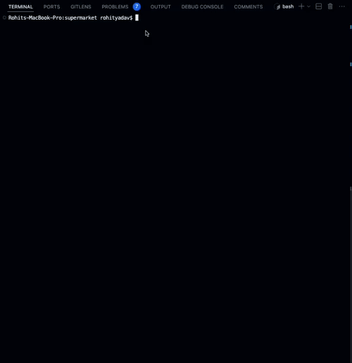

# Supermarket Checkout

## Introduction

This is an implementation of the Supermarket Checkout in Python. The program allows users to input products, their prices, and special offers via the command line, and then calculate the total price of items scanned for checkout. The project applies object-oriented programming principles and includes unit tests.

## Demo



## Features

- **Product Management**: Add products with their prices.
- **Special Offers**: Attach offers to products (e.g., "3 for 130").
- **Interactive Checkout**: Scan items for checkout and calculate the total price with applied offers.
- **Tests**: Unit tests to ensure the correctness of the implementation.

## Prerequisites

- Python 3.x

## Setup and Run

- ### Clone the Repository

```sh
git clone https://github.com/rohity123456/supermarket.git
cd supermarket
```


- ### Running the Program
Ensure you are in the root directory of the project.
```sh
python main.py
or 
python3 main.py
```

- ### Running unit tests:

Follow the instructions in the [Tests](RUNNING_TESTS.md) section.
